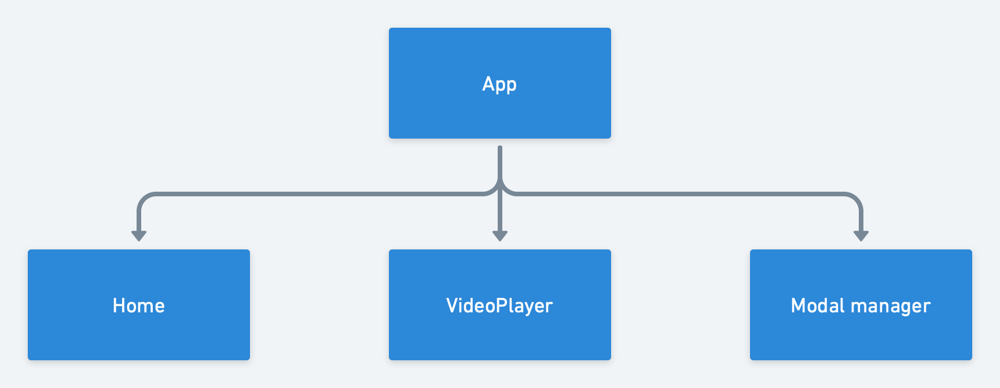
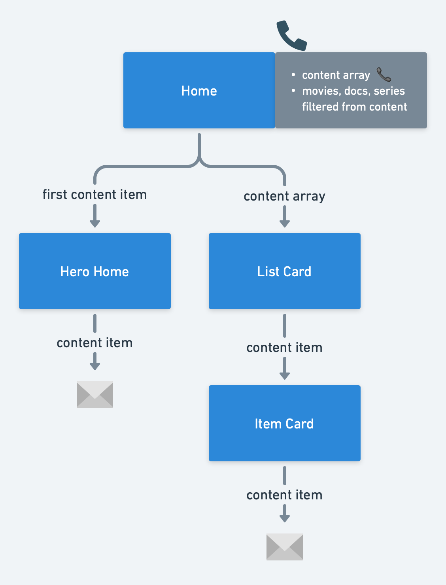
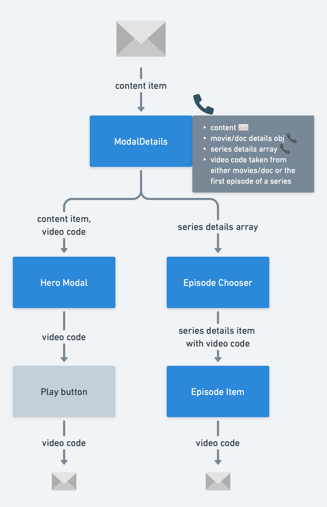

# Natflix

The frontend for project #5 in the TietoEvry Java Course.

# About
I have replaced the fakeFetches with real fetches to the real server. Remember to start the server before running this frontend. You can find a docker-compose -file in this project. That file can be used to start the containers that are needed for the database in the backend. Further instructions for starting the server are in the readme of the backend. 

The project has two branches. The main branch connects to the server without user authentication. 

In the other branch called "auth" I have worked on the sign up and sign in -fetches, but due to a problem
of not getting user data from the server, I have not been able to complete this implementation.

The documentation below has been prepared by Eduardo.

# Installation

#0 Clone the repository
#0 Open a terminal and type `npm install` inside the repository folder
#0 Run `npm start` to open the project in `localhost:3000`

# Organization

This is a complex project, thus here are some hierarchy diagrams to understand the project structure.

## Main diagram

The entry point is `App.tsx` it has a browser router for multi-page navigation. Currently it has the Home page and the VideoPlayer page.

In addition, it has a Modal manager to handle modals/popups globally using Content API.

## Home page

The home page has a hero header that showcases the first item and also filters the content by movies, series, or documentaries.

# Modal details

Once the user clicks on the more info button or item card, the modal manager opens this specific component to display the complementary information.

Here the user can click on the play button to play the movie or documentary. If the user selected an tv-series, then the play button will play the first epidode of the first season.

If is a tv-series, the user can click on the dropdown menu to filter epidodes by season and then click on any episode to watch it.

## Video page

The video page takes the video code sent from the play button or episode item inside the modal detail and opens a YouTube video corresponding to the video code.

